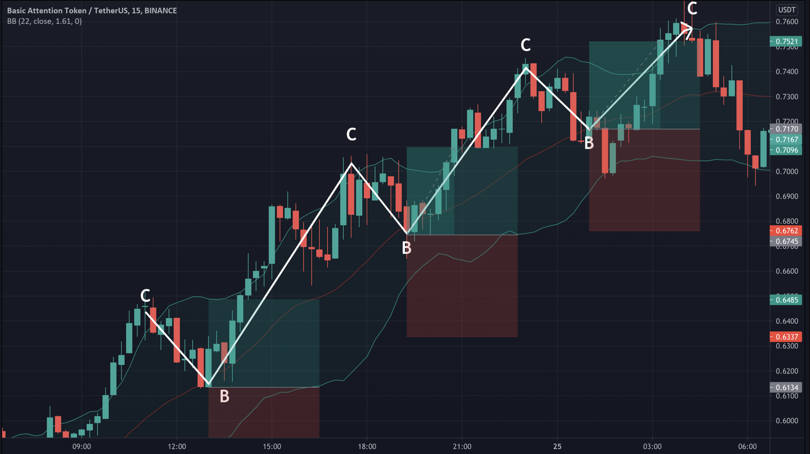
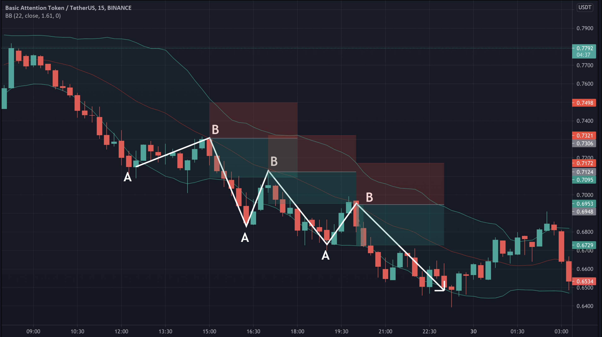
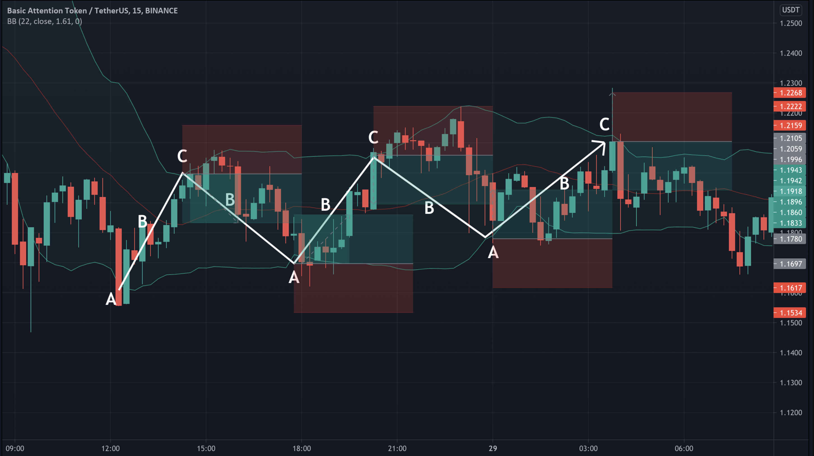
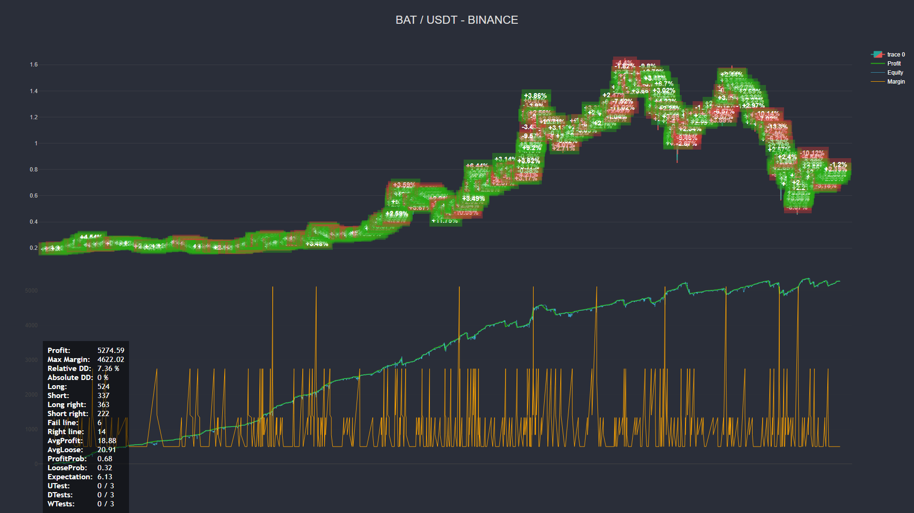
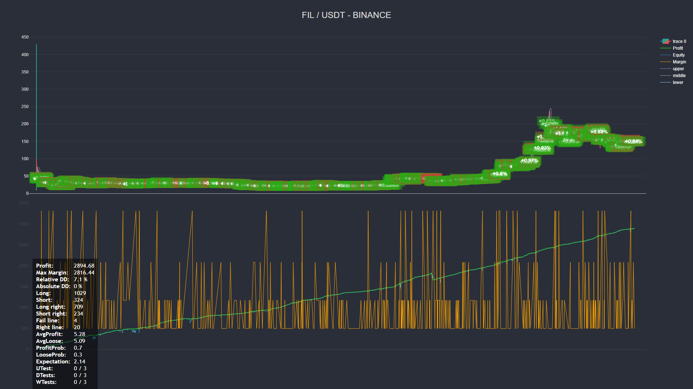

# Spikes Grid Стратегия

Стратегия основана на индикаторе `Bollinger Bands`. Даже при беглом анализе рынка видно, что отбои от границ ВВ отрабатывают не всегда. Очень часто график топчется на месте или продолжает двигаться в том же направлении без разворота и похода к противоположной границе канала. Такие ситуации данная стратегия по задумке, должна отрабатывать наиболее эффективно. Детектирование трендов происходит на основе отсутствий касания одной из границ канала линий Боллинджера более чем `barsTrend` свеч подряд. Рассмотрим схемотично 2 локальных тренда на рисунках ниже.

## Торговля по тренду

Восходящее движение           |  Нисходящее движение
:------------------------------------------------------------------:|:-------------------------------------------------------------------------:
  |  

При восходящем движении не происходит касания нижней границы канала BB, сыграем на этом и будем открывать сделки по тренду (лонг) при откатах до уровня средней линии каналов (на рисунке обозначено точкой `B`). Позиция точки `C` нам не важна, важно ее наличие, поэтому, в случае продолжительных импульсов у верхних границ канала точку `C` можно обозначить на окончании этого импульса, лишь регистрируя факт столкновения цены с верхним каналом.

При нисходящем тренде цена не доходит до верхней границы, чаще всего отталкиваясь от средней линии (на графике также точка `B`). Как и в предыдущем случае регистрируем лишь наличие соприкосновения цены с нижней границей линий, обозначим это точкой `A`. При нисходящем движении локальная коррекция достигает лишь середины каналов и при достижении точки `B` открываем короткую позицию (шорт).

### Выход из тренда

На выходе из тренда, либо на случай неожиданного движения, создаем `Grid`. Это происхоидт когда одна из сделок достигает уровня цены закрытия в убыток (стопа). Далее пытаемся докупать или допродавать по сетке, чтобы вывести сделку в прибыльный уровень.

## Торговля против тренда

Тут все по классике, стандартная стратегия отскока цены от верхней и нижней границ каналов. При отсутсвии такового также выполняется вход в серию "сеточных" сделок докупки или допродажи с увеличением лотности на каждую, в попытке все же взять свою прибыль с этой сделки. Также дополнительным фильтром для входов, служит наличие точки пересечения средней границы. Таким образом сигналы будут состоять из трех точек `ABC` - _Шорт_  `CBA` - _Лонг_.

<b>Отскок от верхней и нижней границ канала.</b>

## Параметры стратегии

| Название | Тип | Описание   |
|-----------|----------|------------|
| bandsPeriod  |  number (int) | Период Bollinger Bands |
| bandsDev  |  number | Стандартное отклонение в Bollinger Bands |
| usePeaks  |  boolean | Считать ли касание тенью свечи достижением уровня |
| barsTrend  |  number (int) | Сколько свечей без касаний верха или низа является сигналом тренда |
| eventExpireBars  |  number (int) | Спустя сколько свеч забывается событие `A`, `B` или `C` |
| barsTrend  |  number (int) | Сколько свечей без касаний верха или низа является сигналом тренда |
| reinvest  |  boolean | Реинвестируем ли прибыль |
| buyOnly  |  boolean | Используем только Лонг позиции (например если нет плеча для шорта)  |
| useClose  |  boolean | Используем противоположные сигналы для закрытия позиций, но только если не вошли в сетку |
| takeProfit  |  boolean | Урвоень тейка, считает как общий уровень доходности всех позиций в процентах от баланса (`amount`) |
| stopLoss  |  boolean | Стоп считает как общий уровень убытка в процентах от баланса (`amout`) |
| step  |  boolean | Шаг всех уровней или первого уровня если включен фибо |
| levelsCount  |  number | Количество уровней в сетке |
| martingale  |  number \[1-2\] | Коэффициент мартингейла для сетки |
| fibo  |  boolean | Уровни по Фибоначчи для сетки |
| reversed  |  boolean | Сетка контр трендовая или трендовая (true - контр трендовая) |

## Результаты в тестере, после генетической оптимизации

